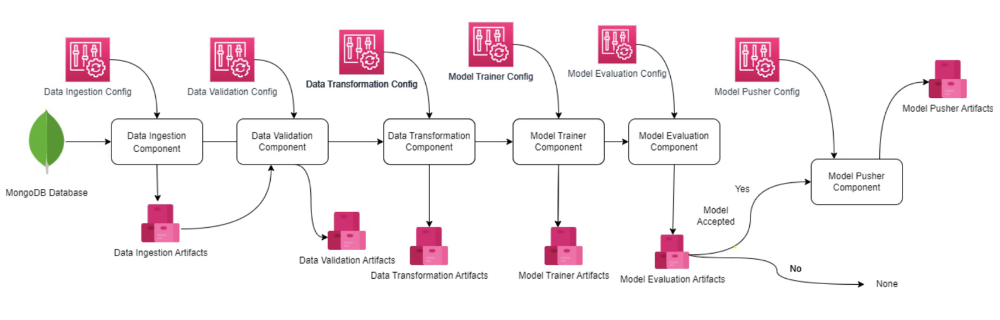

# Network Security System Project for Phishing Data

This project focuses on building a Network Security System that processes phishing data using ETL (Extract, Transform, Load) pipelines.

## 📌 Overview

The system is designed to identify and analyze phishing-related data through structured data workflows. It aims to automate the ingestion and processing of large datasets related to phishing activities for security analysis and detection.

## Workflow

## ⚙️ ETL Pipeline

The core of this system is built around the ETL process:

### 🟢 Extract
- Data is extracted from **CSV files** (currently from a file source, can be extended to APIs or real-time feeds).
- The CSV is read into a **Pandas DataFrame** and converted into a JSON-like format (Python dictionaries) for further use.

### 🟡 Transform
- Data is cleaned and structured into a format suitable for insertion into **MongoDB**.
- Future transformation logic (e.g., feature engineering, preprocessing) will be integrated here.

### 🔵 Load
- Data is loaded into a **MongoDB Atlas** cluster.
- The connection uses secure TLS (SSL) via the `certifi` CA bundle and a `.env` configuration for credentials.
- The MongoDB insertion logic handles:
  - Creating a client.
  - Connecting to a specific **database** and **collection**.
  - Uploading all records from the DataFrame.

This modular pipeline ensures data consistency, scalability, and ease of monitoring.

---

## ✅ Current Progress

-  Project structure and directories have been set up.
-  Logging system implemented for monitoring pipeline events and tracking.
-  Exception handling mechanisms in place to ensure robust and fault-tolerant processing.
-  Configurable training pipeline directory and ingestion config completed.
-  Data is successfully inserted into **MongoDB Atlas** using a real CSV file.

---

More components will be added in future iterations.

---

