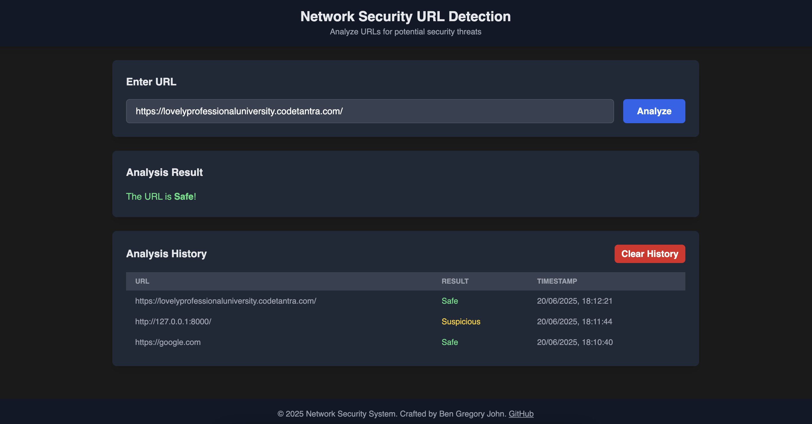
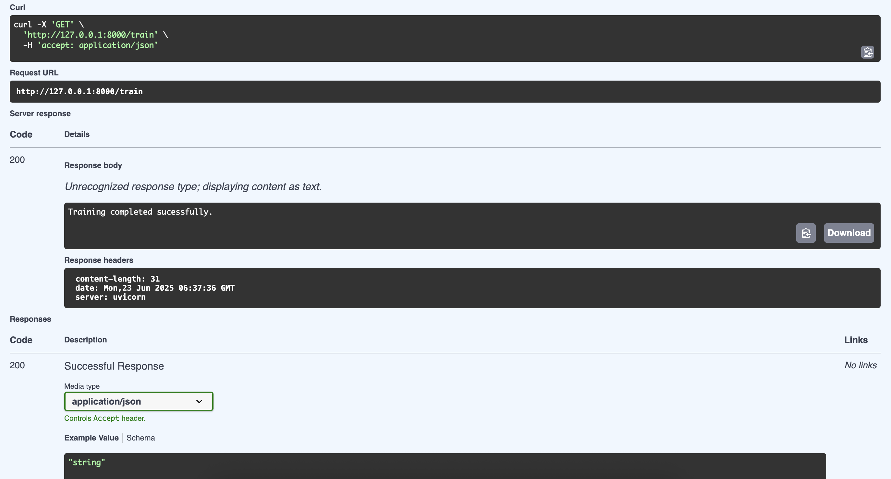
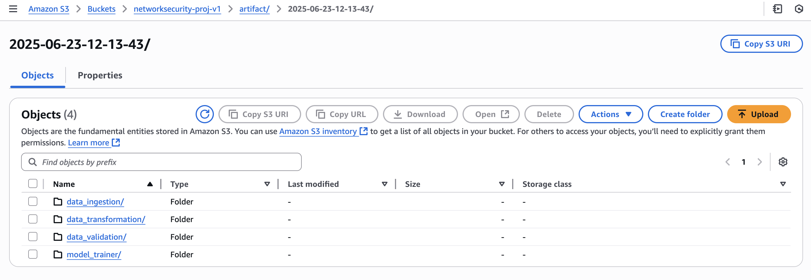
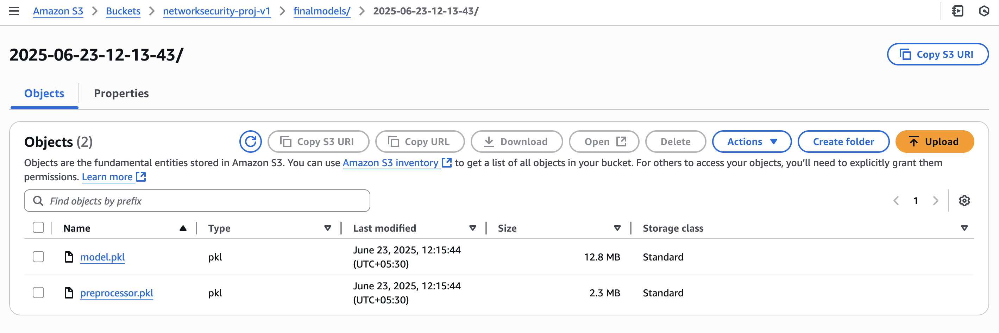

# Network Security ML Project for URL Security Analysis

This project focuses on building a Network Security System that processes phishing data using ETL (Extract, Transform, Load) pipelines. A project designed to empower users with a robust tool for analyzing URLs and detecting potential security threats, such as phishing and malicious links. In an era where cyber threats are increasingly sophisticated, the need for accessible and reliable security solutions has never been greater.

## Overview

The system, is engineered to identify, analyze, and mitigate phishing-related threats through a structured and automated data workflow. It is designed to streamline the ingestion and processing of extensive datasets associated with phishing activities, ensuring robust security analysis and accurate threat detection. The pipeline incorporates several critical stages: data validation to ensure data integrity, transformation to prepare data for analysis, model building to develop predictive algorithms, and deployment processes to push the trained models and insights into production, enabling real-time security enhancements.


## Technical Infrastructure

| **Category**             | **Tools/Technologies**                                  | **Description**                                                |
|--------------------------|---------------------------------------------------------|----------------------------------------------------------------|
| **Frontend**             | Tailwind CSS, HTML, JavaScript                          | Delivers a responsive and interactive user interface for real-time URL analysis|
| **Backend**              | FastAPI, Flask                                          | Handles batch predictions and API endpoints.                   |
| **Database**             | MongoDB Atlas                                           | Provides a secure, cloud-based storage solution for analysis history|
| **ML Models**            | Random Forest, Adaboost, Gradient Boost                 | Implements advanced machine learning models to accurately detect malicious URLs|
| **Tracking**             | Custom Logging                                          | Tracks model performance metrics like F1-score, precision, and recall via logs|
| **Cloud Storage**        | AWS S3 Bucket                                           | Stores artifacts, trained models with logs                     |
---

## Prediction Review


 
---

## FastAPI Backend
FastAPI powers the backend operations of the model, enabling both automated training and real-time predictions:

- Training Endpoint (/train): Exposes a REST endpoint to trigger the entire training pipeline—including data ingestion, validation, transformation, and model training. Also pushes artifacts and trained models to AWS S3 bucket named `networksecurity-proj-v1`

- Batch Prediction Endpoint (/predict): Supports batch inference by accepting CSV file uploads containing multiple URL records. The system processes the input, applies the saved model and preprocessor, and returns the predictions in a user-friendly HTML table. Optionally, results can be saved.

- Training Execution:
  

- AWS S3 Buckets:

  
  

---
## Workflow


##  ETL Pipeline – Extract, Transform, Load

### Extract
- Data is extracted from **CSV files** (currently local source, extendable to APIs/streams).
- Loaded into **Pandas DataFrames** and then converted to Python dictionary format for MongoDB ingestion.

### Transform
- Data cleaning and structuring.
- Future scope: Feature engineering, advanced transformations, scaling, and encoding.

### Load
- Loads data into a **MongoDB Atlas** cluster using secure TLS connection.
- MongoDB operations include:
  - Client creation via `.env` credentials
  - Database and collection access
  - Bulk insertion of records


---

## Data Ingestion

The **Data Ingestion** module fetches raw data and prepares it for further processing.

- Reads data from CSV files, serving as the initial data source (with potential for future API or streaming integration).
- Performs a stratified train-test split to ensure balanced representation across classes (e.g., safe, suspicious, malicious URLs).
- Organizes and saves artifacts, such as processed datasets, in a structured directory.
- Generates a `DataIngestionArtifact` that includes metadata and file paths for traceability.

**Benefits**: This approach ensures reproducibility and provides a clean, traceable interface for downstream pipeline stages, making it easy to integrate with subsequent processes.

--- 

## Data Validation

The **Data Validation** module ensures input data quality and schema compliance.

### Schema Validation
- Validates column count and names/types using a schema YAML file
- Ensures required numerical columns are present

### Statistical Drift Detection
- Uses **Kolmogorov–Smirnov test** to detect dataset drift
- Generates a detailed **drift report (YAML)**

### Logs & Artifacts
- Logs validation steps and errors
- Produces validated paths for next pipeline stages

**Benefits**: This phase enhances model reliability by maintaining test-train consistency and mitigating risks from corrupted or drifted data.

---

## Data Transformation

This module prepares validated data for machine learning.

- Applies **KNN Imputation** (`KNNImputer`) for missing values
- Encodes labels (`-1` ➝ `0`)
- Uses a **Scikit-learn pipeline** for transformation
- Saves:
  - Processed **NumPy arrays**
  - The **transformer object** 

**Benefits**: The transformed data is clean and optimized for machine learning, with stored transformation logic enabling consistent inference on new data.

---

## Model Training

The **Model Trainer** selects and trains the best-performing model from multiple ML algorithms using hyperparameter tuning.

- **Supported Models**: Includes Random Forest, Decision Tree, Gradient Boosting, AdaBoost, and Logistic Regression, offering a diverse range of approaches.

- **Evaluation**: Utilizes GridSearchCV to train models with predefined parameter grids, evaluating performance using metrics such as F1 score, precision, and recall. Performance logs are maintained for each model.

- **Output**: Saves the best model along with its preprocessor using `pickle`, and returns a `ModelTrainerArtifact` containing the trained model path and evaluation metrics for both training and test sets.

**Benefits**: This automated and modular design simplifies model selection, ensures high performance, and preserves the entire pipeline for future use.

---


## Conclusion
This project represents a significant step toward democratizing URL security analysis. By leveraging a robust technology stack and a well-defined MLOps pipeline, we have created a tool that is both powerful and accessible. This project is an ongoing effort, with plans to expand data sources, refine models, and enhance the user interface based on user feedback. We invite you to explore the code, contribute to its development, and use it to safeguard your online experience.

---


## To run and test this locally:

- Clone the repository: 
```bash
git clone git@github.com:BenGJ10/Network-Security-System.git
```
- Install dependencies: 
```bash
pip install -r requirements.txt
```
- Set up MongoDB Atlas and update .env with credentials.
```bash
touch .env # Add your MongoDB URL in this file
```
- Run the application: 
``` bash
python3 app.py
```
